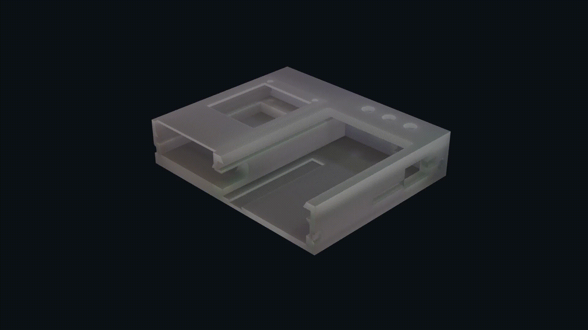

# Car Datalogger
The device logs IMU and GPS data onto an SD card (or slower, serial)

On an SD card, IMU data is recorded at 350-400Hz, target for GPS is 5Hz, but depends on whether the module has a fix.

The screen offers critical stats on where data is being written, whether GPS has a fix, etc.

# Hardware
- TTGO TS V1.4 1.8in, with built-in MPU9250 IMU and buzzer
- Adafruit Ultimate GPS
- Some wires
- Basic soldering skills
- Optional 3D Printable case
- Optional custom car mount, near the CG 
  - could be easily adapted from the mount included on the repo
  - or just use double-sided tape

# Software folders
code
- The project is made in PlatformIO. PlatformIO should take care of all the dependencies and download all that is needed on its own.

data analysis tools
- The logs for GPS and IMU are combined into one file. You can use the included python script to separate the data.
- You can use the MATLAB tools to plot the trajectory on a map, or visualize the IMU data as needed.

# TOCHECK
- file.flush() - fix potential data loss if power cut, effects on write speed

# TODO
- animation
  - screenshot for the animation
      
- SDFat library - file.sync() to preserve recent changes, like flush for sd library - FIGURE OUT HOW TO CHANGE SPI PINS
  - https://forum.arduino.cc/t/sdfat-when-to-call-sync/272019
  - https://forum.arduino.cc/t/explanation-of-sd-write-and-flush-please/369320/5
    
- make imu and GPS sensing interrupt based
    
- rtOS
  - standardise refresh rate

- GPS - https://airu.coe.utah.edu/wp-content/uploads/sites/62/2017/09/adafruit-ultimate-gps.pdf
  - connection stats on screen
  - battery advantages
    
- IMU
  - max refresh rate

- Design
  - soft edges
    
- WiFi
  - autobackup
 
- data processing
  - https://www.youtube.com/watch?v=hJG08iWlres
  - https://x-io.co.uk/open-source-imu-and-ahrs-algorithms/
  - https://www.mathworks.com/help/fusion/ref/insfilterasync.html
